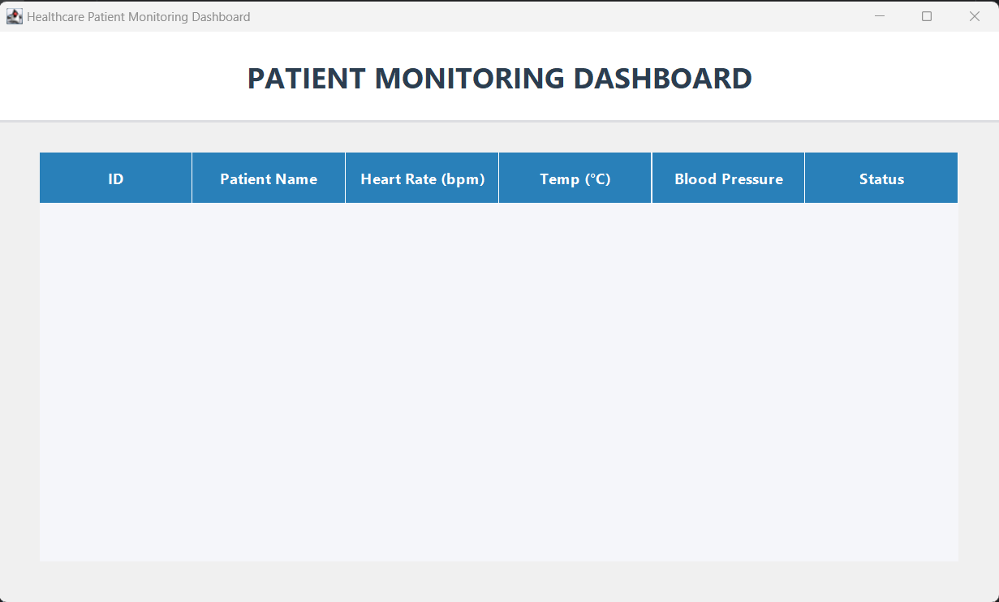
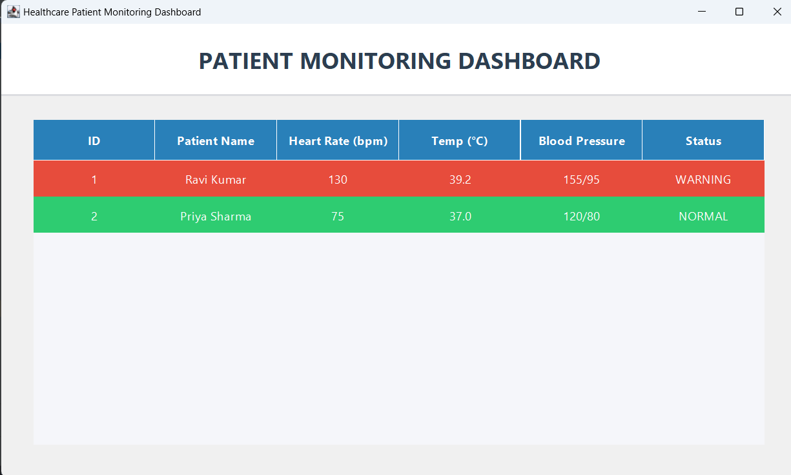
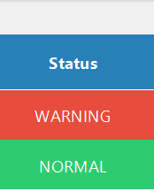
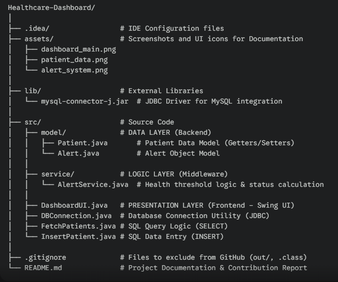

# Health-Dashboard

# 🩺 Healthcare Patient Monitoring Dashboard
## Personal Contribution Report | Kasak Singh | 23BCE10250

> **Role:** Integration, Project Setup & Troubleshooting
> **Focus:** System Architecture, Database Connectivity, and Version Control

---

## 🚀 My Core Contributions
As the **Integration Lead** for this  Advanced Java project at **VIT Bhopal**, I was responsible for transforming individual code components into a synchronized, deployable application.

### 1. Architectural Refactoring (MVC Pattern)
I migrated the project from a flat directory to a professional **Model-View-Controller (MVC)** structure. 
* Organized classes into dedicated `model` and `service` packages.
* Updated all internal `import` statements and `package` declarations to ensure cross-module compatibility.
* Standardized the project for **IntelliJ IDEA** and **OpenJDK 23/26**.

### 2. Backend-to-UI Integration
I developed the "glue" code that allows the frontend to communicate with the MySQL database:
* **Data Mapping:** Integrated the `Patient` model with the `JTable` using `DefaultTableModel`.
* **Dynamic Rendering:** Implemented the logic for the `TableCellRenderer`, which calculates health thresholds in real-time to trigger **Visual Alerts** (Red/Green row highlighting).
* **Dependency Management:** Configured the `mysql-connector-j` libraries and resolved classpath conflicts.

### 3. DevOps & GitHub Management
* Managed the repository lifecycle, handled merge conflicts between team members, and maintained the `.gitignore` to keep the repo clean of compiled `.class` files.
* Resolved critical **Build Path** errors ("System cannot find the path specified") caused by environment mismatches.

---

## 🛠️ Technical Stack 
* **Language:** Java (Advanced)
* **Architecture:** MVC (Model-View-Controller)
* **Database:** JDBC, MySQL
* **Tools:** IntelliJ IDEA, Git, GitHub
* **GUI:** Java Swing (Advanced Layouts & Custom Renderers)

## Dashboard Preview

### Main Dashboard

### Patient Data

### Alert System 

## How to Run
1. Clone this repository
   git clone https://github.com/Kasak-beep/Healthcare-Dashboard
2. Open project in your IDE (Eclipse/IntelliJ)
3. Setup MySQL database using files in /database folder
4. Run the main file from /src folder

## Project Structure

---

## 📊 Dashboard Preview (My Integration Work)

### **Alert System Logic**
| Criteria | Status | UI Feedback |
| :--- | :--- | :--- |
| Heart Rate > 120 or < 60 | **WARNING** | **Red Highlight** |
| Temperature > 38°C | **WARNING** | **Red Highlight** |
| Within Normal Range | **NORMAL** | **Green Highlight** |

---

## 🎓 Academic Details
* **University:** VIT Bhopal
* **Specialization:** B.Tech Computer Science 
* **Subject:** Advanced Java Programming 
